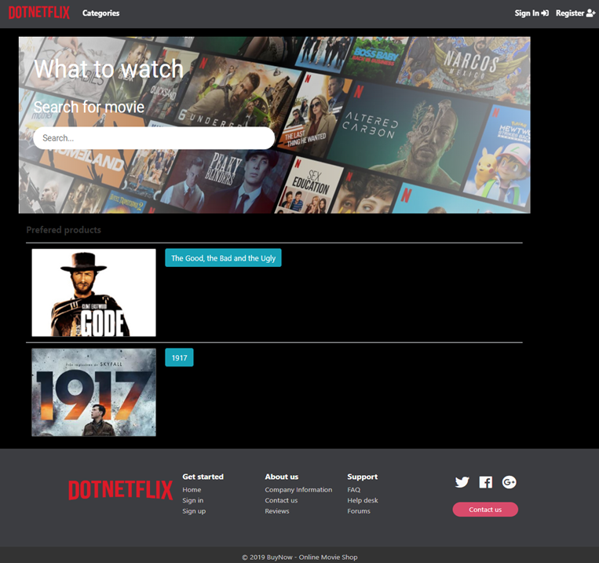
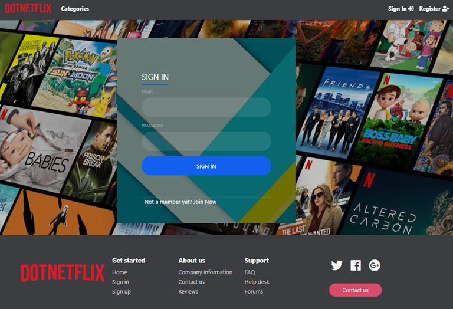
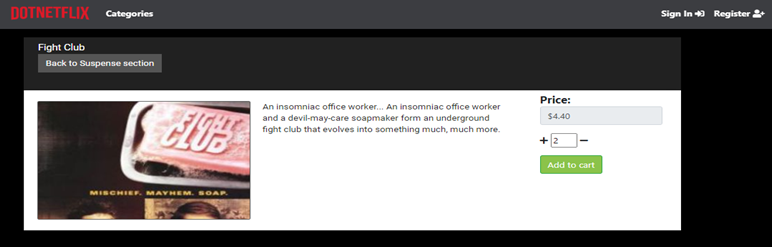
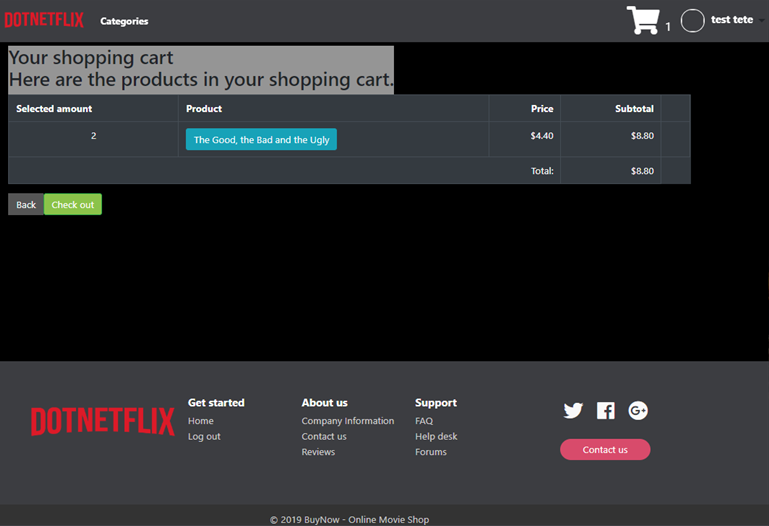
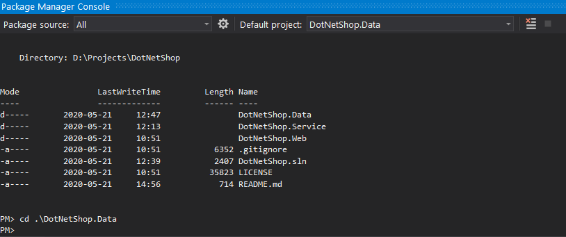

## DotNetShop
Simple Movie Shop 

* Preview

    

    

    
    
    

* Source [solution](https://github.com/mcmdothub/DotNetShop.git)
  ```
  $ git clone https://github.com/mcmdothub/DotNetShop.git
  ```

* User Admin Login

  ```
  "user": "admin@mail.com"
  "pass": "aA1234"
  ```

##### Before build the project
------------------------------------------------------------
* Package Manager Console Host Version 5.5.0.6473

    

  > Package Manager Console: Default project: DotNetShop.Data
  >
  > PM> Type 'get-help NuGet' to see all available NuGet commands.
  >
  > PM> cd  .\DotNetShop.Data
  > PM> add-migration "InitMigration"	|	PM> Add-Migration Initial -Context ApplicationDbContext
  >

  ```
  Build started...
  Build succeeded.
  To undo this action, use Remove-Migration.
  ```

  > PM> update-database

  ```
  Build started...
  Build succeeded.
  Applying migration '20200521082218_Initial'.
  ```


##### Run the project 
------------------------------------------------------------
* Run in terminal/package manager console

  > Set default project: DotNetShop.Web


  ```
  dotnet run
  ```

##### Project Tools
------------------------------------------------------------
- [x] .Net Core 3
- [x] MVC
- [x] Entity Framework with Code first
- [ ] this is an incomplete item
- [ ] 
